# Game1 项目框架文档

**更新日期:** 2026-04-23
**版本:** 1.0
**Unity:** 6000.1.5f1

---

## 1. 项目概述

### 1.1 项目类型
挂机放置类游戏，包含旅行、事件、Roguelike、战斗元素。

### 1.2 技术栈
| 组件 | 版本 |
|------|------|
| Unity | 6000.1.5f1 |
| URP | 17.1.0 |
| C# | 9.0 |
| .NET | 4.7.1 |
| Input System | 1.14.0 |
| UniWindowController | 0.9.8 |

### 1.3 目标平台
Windows 64位透明悬浮窗

---

## 2. 整体架构

### 2.1 架构层次图

```
┌─────────────────────────────────────────────────────────────────┐
│                        Unity Engine                              │
├─────────────────────────────────────────────────────────────────┤
│  ┌──────────────────────────────────────────────────────────┐  │
│  │                    GameMain (入口)                        │  │
│  │  - 单例模式                                                │  │
│  │  - 管理所有子系统                                          │  │
│  │  - 初始化协调                                              │  │
│  └──────────────────────────────────────────────────────────┘  │
├─────────────────────────────────────────────────────────────────┤
│  ┌────────────────┐  ┌────────────────┐  ┌────────────────┐   │
│  │   UI Layer     │  │  Core Systems  │  │  Game Modules  │   │
│  │  (UIManager)   │  │  (Core/*)      │  │  (Modules/*)   │   │
│  └────────────────┘  └────────────────┘  └────────────────┘   │
├─────────────────────────────────────────────────────────────────┤
│  ┌────────────────┐  ┌────────────────┐  ┌────────────────┐   │
│  │    Entities    │  │     Data      │  │    Events     │   │
│  │  (Entities/*)  │  │ (Inventory)   │  │   (Events/*)   │   │
│  └────────────────┘  └────────────────┘  └────────────────┘   │
└─────────────────────────────────────────────────────────────────┘
```

### 2.2 启动流程图

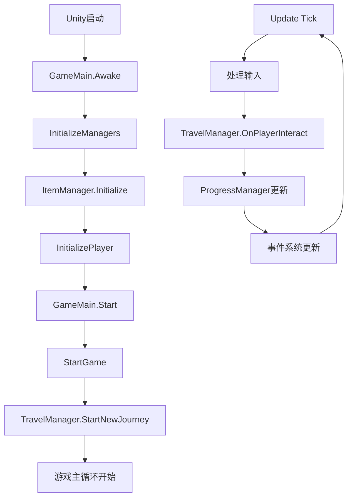

---

## 3. 核心系统 (Core)

### 3.1 Core/GameLoop - 游戏循环

```
GameLoopManager
├── Tick()              # 主循环更新
├── FixedTick()          # 物理更新
└── LateTick()           # 相机更新后
```

### 3.2 Core/SaveSystem - 存档系统

```
SaveManager
├── Save()               # 保存游戏
├── Load()               # 加载游戏
├── AutoSave()           # 自动存档
└── GetSavePath()        # 获取存档路径
```

### 3.3 Core/EventBus - 事件总线

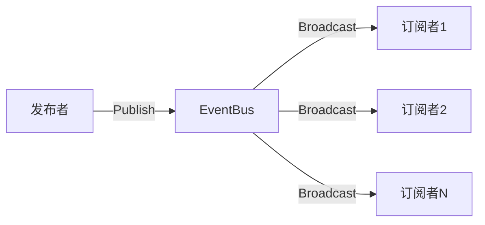

```csharp
// 使用示例
EventBus.instance.Publish(new InventoryEventData(...));
EventBus.instance.Subscribe<InventoryEventData>(OnInventoryChanged);
```

### 3.4 Core/Input - 输入管理

```
BackgroundInputManager
├── 处理后台输入
├── UniWindowController集成
└── Input System (Keyboard.current)
```

### 3.5 Core/Debug - 调试系统

```
GameDebug
├── 显示运行时信息
├── 性能监控
└── 调试面板
```

### 3.6 Core/Utils - 工具类

| 类 | 功能 |
|----|------|
| ResourceManager | 资源加载 (JSON/XML) |
| Utils | 通用工具方法 |
| UniTaskProgress | 任务进度 |

---

## 4. 游戏模块 (Modules)

### 4.1 Modules/Idle - 挂机收益

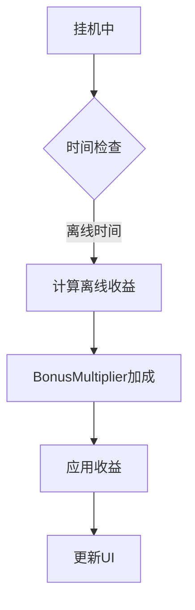

```
IdleRewardModule
├── CalculateOfflineReward()   # 计算离线收益
├── ApplyReward()              # 应用收益
└── GetBonus()                 # 获取加成
```

### 4.2 Modules/Travel - 旅行系统

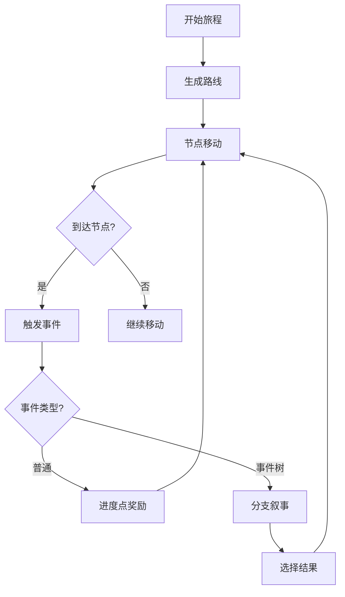

```
TravelManager
├── StartNewJourney()          # 开始新旅程
├── SetEventQueue()            # 设置事件队列
├── OnPlayerInteract()         # 玩家交互
└── ProgressManager            # 进度管理

ProgressManager
├── travelPoint                # 旅行点
├── travelRate                 # TP/s计算
└── pointsPerEvent             # 触发事件的阈值
```

### 4.3 Modules/Combat - 战斗系统

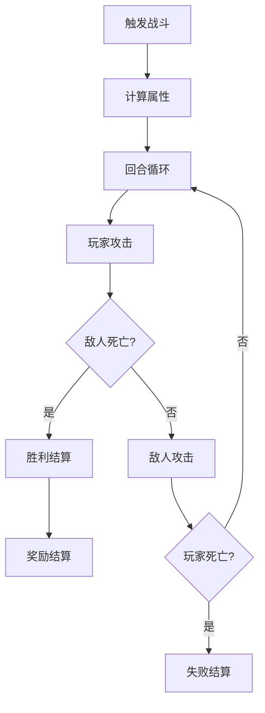

```
CombatSystem (单例)
├── ExecuteCombat()            # 执行战斗
├── CalculateDamage()          # 伤害计算
└── CanVictory()               # 胜负预判
```

### 4.4 Modules/Team - 队伍系统

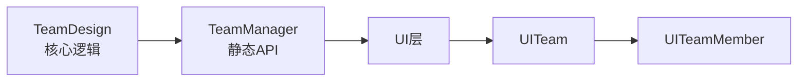

```
TeamDesign (单例)
├── AddMember()                # 添加成员
├── RemoveMember()             # 移除成员
├── UpdateMember()             # 更新成员
├── GetTotalCombatPower()      # 总战斗力
└── events: onTeamChanged

TeamManager (静态API)
├── AddMember()                # 委托给TeamDesign
├── RemoveMember()
├── GetAllMembers()
└── SubscribeTeamChanged()

TeamMemberData
├── id, name, level
├── hp, maxHp, attack, defense
└── IsAlive, hpPercent, GetCombatPower()
```

---

## 5. 数据层 (Data)

### 5.1 Inventory - 背包系统

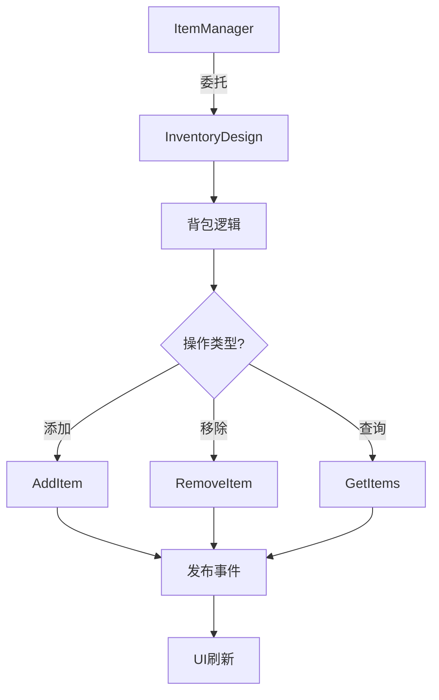

```
InventoryDesign (单例)
├── AddItem()                   # 添加物品
├── RemoveItem()                # 移除物品
├── GetAllItems()              # 获取所有物品
├── CanAddItem()               # 检查能否添加
└── events: onInventoryChanged

ItemManager (静态API)
├── Initialize()               # [RuntimeInitializeOnLoadMethod]
├── GetTemplate()              # 获取物品模板
└── 委托给InventoryDesign处理背包操作
```

### 5.2 Resources/Data - 配置数据

```
Data/
├── Items/Items.xml             # 物品配置
├── Events/Events.xml          # 事件配置
└── EventTrees/EventTrees.xml  # 事件树配置
```

---

## 6. 事件系统 (Events)

### 6.1 事件类型

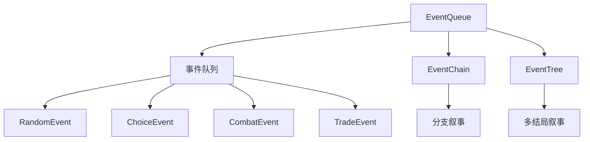

```
EventQueue        # 事件队列
├── IGameEvent    # 事件接口
├── EventResult   # 事件结果
├── CombatEvent   # 战斗事件
└── TradeEvent     # 交易事件

EventChain        # 事件链
├── EventChainNode    # 节点
└── EventChoice       # 选项

EventTreeManager  # 事件树管理
├── LoadTree()        # 加载事件树
└── GetTree()         # 获取事件树

EventTreeRunner   # 事件树运行器
├── Execute()         # 执行
├── SelectChoice()     # 选择
└── EventTreeState     # 状态枚举
```

---

## 7. UI系统 (UI)

### 7.1 UI架构

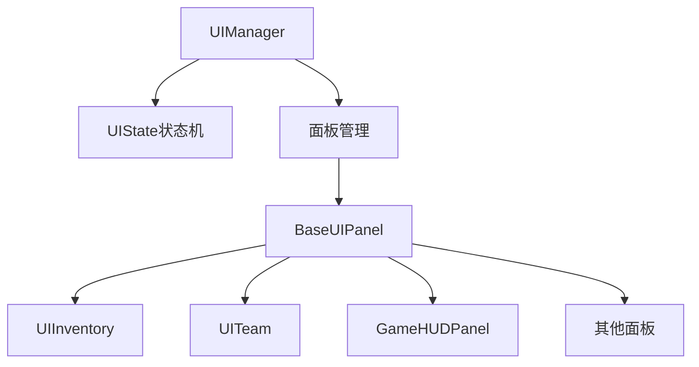

```
UIManager
├── UIState              # 状态枚举
├── IUIPanel             # 面板接口
├── BaseUIPanel          # 面板基类
├── OpenPanel()          # 打开面板
├── ClosePanel()         # 关闭面板
└── ChangeState()        # 状态切换

BaseUIPanel
├── panelId              # 面板ID
├── isOpen               # 是否打开
├── OnOpen()             # 打开回调
└── OnClose()            # 关闭回调
```

### 7.2 UI组件

| 组件 | 功能 |
|------|------|
| UIInventory | 背包UI |
| UITeam | 队伍UI |
| UIProgressBar | 进度条 |
| UIText | TextMeshPro封装 |
| UILayout | 布局系统 |
| UIListItems | 列表管理 |
| UISelectionDialog | 选择对话框 |
| UIMapPath | 地图路径UI |

### 7.3 UIListItems - 列表管理

```
UIListItems
├── XObjectPool           # 对象池
├── AddItem()              # 添加列表项
├── RemoveItem()           # 移除列表项
└── Clear()                # 清空
```

---

## 8. 实体层 (Entities)

### 8.1 Entities/Player - 玩家

```
PlayerActor
├── id, actorName, level
├── Stats                  # 生命值、攻击力、防御力等
├── CarryItems            # 金币、拥有模块等
├── TravelState           # 旅行状态
└── ModuleCollection      # 模块集合

IModule                   # 模块接口
├── moduleId
├── moduleName
├── GetBonus()
├── Tick()
└── OnActivate/OnDeactivate
```

### 8.2 Entities/World - 世界

```
WorldMap
├── locations[]           # 地点节点
├── GenerateMap()         # 生成地图
└── GetCurrentLocation()

Location
├── id, name
├── connections[]         # 连接
└── events[]
```

### 8.3 Entities/NPC - NPC

```
NPCSystem
├── npcs[]               # NPC列表
├── SpawnNPC()
└── Interact()
```

---

## 9. 数据流向图

### 9.1 玩家交互数据流

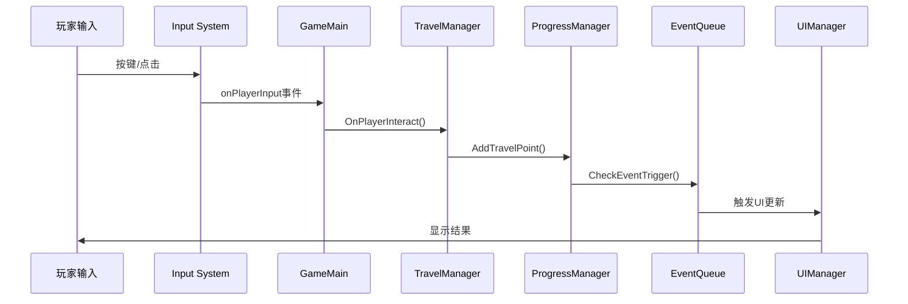

### 9.2 物品操作数据流

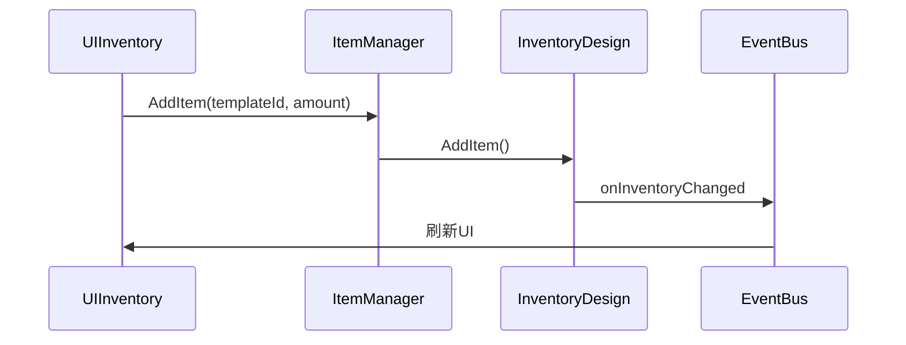

---

## 10. 模块依赖关系

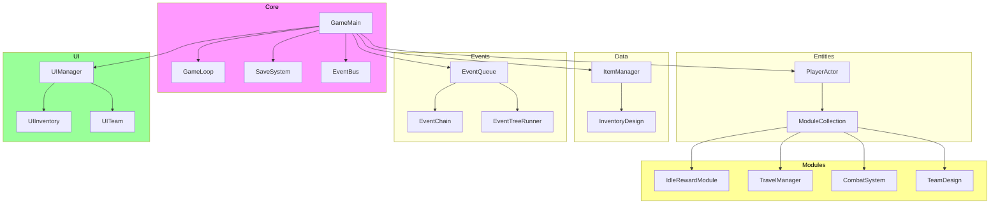

---

## 11. 文件结构总览

```
Assets/Scripts/
├── Core/                    # 核心系统
│   ├── GameLoop/            # 游戏循环
│   ├── SaveSystem/          # 存档系统
│   ├── EventBus/            # 事件总线
│   ├── Input/               # 输入管理
│   ├── Debug/               # 调试系统
│   └── Utils/               # 工具类
├── Modules/                 # 游戏模块
│   ├── Idle/                # 挂机收益
│   ├── Travel/              # 旅行系统
│   ├── Combat/              # 战斗系统
│   └── Team/                # 队伍系统
├── Entities/               # 实体
│   ├── Player/              # 玩家
│   ├── World/               # 世界
│   └── NPC/                 # NPC
├── Inventory/               # 背包核心
├── Events/                  # 事件系统
├── Roguelike/               # Roguelike
├── UI/                      # UI系统
│   ├── Dialog/
│   ├── Map/
│   └── Utils/
├── Managers/                # 管理器
│   └── ItemManager.cs
├── GameMain.cs              # 游戏入口
└── GameTest.cs              # 测试类
```

---

## 12. 关键设计模式

### 12.1 单例模式
- GameMain, UIManager, InventoryDesign, TeamDesign, CombatSystem
- 通过 `instance` 属性访问

### 12.2 静态API模式
- ItemManager, TeamManager, EventBus
- 提供全局访问点，委托给单例

### 12.3 事件驱动
- EventBus 发布-订阅
- 模块间解耦

### 12.4 对象池
- UIListItems 使用 XObjectPool
- 减少GC

---

## 13. 命名规范

| 类型 | 规范 | 示例 |
|------|------|------|
| 命名空间 | PascalCase | `Game1`, `Game1.UI` |
| 类名 | PascalCase | `PlayerActor`, `UIManager` |
| 方法名 | PascalCase | `OnPlayerInteract`, `AddItem` |
| 私有字段 | `_camelCase` | `_items`, `_capacity` |
| SerializeField | private + `[SerializeField]` | `[SerializeField] private int _value` |
| 常量 | PascalCase | `MaxTeamSize` |

---

## 14. 注意事项

1. **Input System**: 使用 `Keyboard.current` 而非 `UnityEngine.Input`
2. **禁止空MonoBehaviour**: 每个脚本必须有实际功能
3. **缓存组件引用**: Awake/Start中缓存，Update中不GetComponent
4. **异步加载**: 大资源使用 Addressables/async
5. **透明窗口**: 需要 D3D11 + FlipModel禁用 + HDR关闭

---

*文档生成时间: 2026-04-23*
